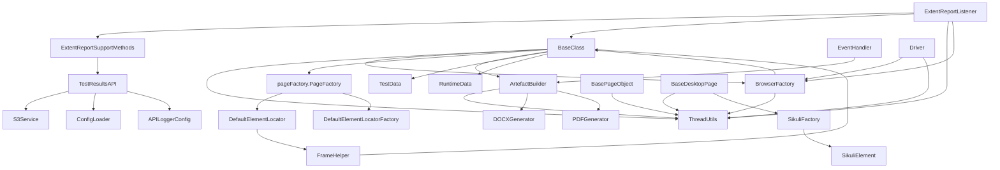
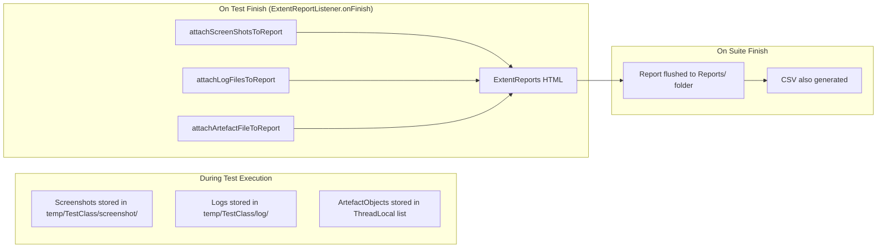
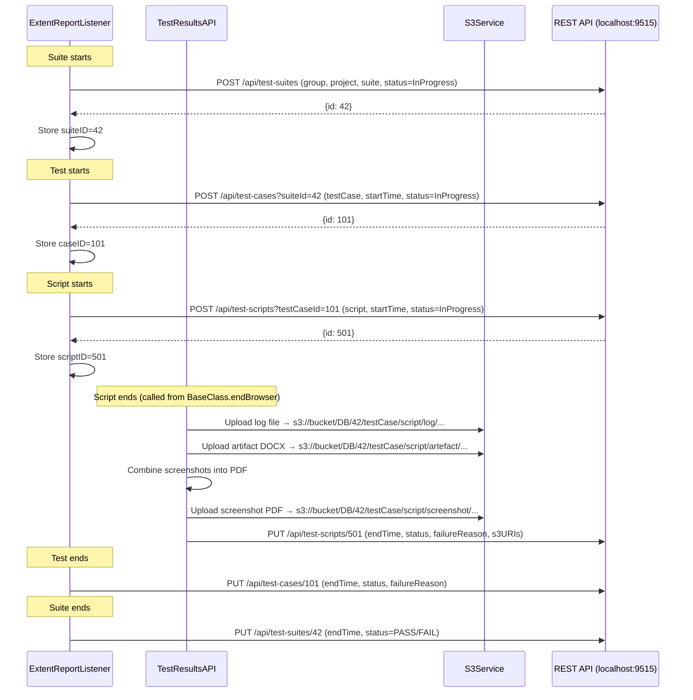

# Infor CQA Test Automation Framework — Developer Contribution Guide

**Version:** 0.0.10  
**Audience:** Engineers contributing to the framework library itself (not just consuming it)

---

## Table of Contents

1. [Orientation: What You're Working On](#1-orientation)
2. [Internal Architecture & Class Relationships](#2-internal-architecture)
3. [The Threading Model](#3-the-threading-model)
4. [How the Custom PageFactory Works Internally](#4-custom-pagefactory-internals)
5. [The Evidence System: ArtefactBuilder + EventHandler](#5-the-evidence-system)
6. [The Reporting Pipeline](#6-the-reporting-pipeline)
7. [The Test Result Publishing System](#7-test-result-publishing)
8. [The Document Generation Engine](#8-document-generation-engine)
9. [SikuliX Desktop Automation Internals](#9-sikulix-internals)
10. [How to Extend the Framework](#10-how-to-extend)
11. [Technical Debt & Refactoring Opportunities](#11-technical-debt)
12. [Contribution Patterns & Anti-Patterns](#12-contribution-patterns)

---

## 1. Orientation

### Your Role

You are contributing to the **library** (`inforTestAutomation`), not writing tests against it. Your changes affect every team that depends on this JAR. A bug you introduce here breaks dozens of test suites across Infor.

### What This Library Actually Does

It sits between TestNG and Selenium, intercepting the test lifecycle to provide:

1. **Managed browser sessions** — creation, configuration, thread isolation, cleanup
2. **Smart element location** — automatic iframe switching before every element find
3. **Automatic evidence capture** — every click/type is screenshot-documented without test authors doing anything
4. **Multi-format document generation** — DOCX, PDF, XLS from captured evidence
5. **Result publishing** — REST API calls to a database + S3 artifact uploads
6. **Parallel safety** — all of the above works correctly when TestNG runs N tests simultaneously

### The Dependency Chain

```
Consumer Test Project
    └── depends on → inforTestAutomation (this library)
                         └── depends on → Selenium, TestNG, POI, iText, SikuliX, AWS SDK, etc.
```

When you change a public method signature, add a dependency, or alter behavior, you impact consumers. The `sampleTestProject` in this workspace is your integration test bed.

### Build & Verify Your Changes

```bash
# In inforTestAutomation/
mvn clean compile                    # Does it compile?
mvn clean package                    # Does it package?

# In sampleTestProject/ (update version if needed)
mvn clean compile                    # Does the consumer still compile?
mvn test -DTEST_PLAN=SampleSuite.xml # Does a basic test still pass?
```

---

## 2. Internal Architecture & Class Relationships

### Class Dependency Graph



### Inheritance Hierarchy

```
Object
├── BaseClass (@Listeners annotation)
│   ├── BrowserFactory (static utility, extends BaseClass for getParameter/getDriver access)
│   ├── ArtefactBuilder (static utility)
│   │   └── EventHandler (implements WebDriverListener)
│   │       └── ExtentReportSupportMethods
│   │           └── TestResultsAPI (implements ITestListener)
│   │               └── ExtentReportListener (THE main listener)
│   └── [All test scripts in consumer projects]
│
├── BasePageObject<B> (for web page objects)
└── BaseDesktopPage<B> (for Sikuli desktop page objects)
```

**Critical insight**: `BrowserFactory`, `ArtefactBuilder`, `EventHandler`, `ExtentReportSupportMethods`, `TestResultsAPI`, and `ExtentReportListener` all inherit from `BaseClass`. This gives them access to `getParameter()`, `getDriver()`, `log()`, etc. — but it also means the inheritance chain is deep and tightly coupled.

### Package Responsibilities

| Package | Responsibility | Who Typically Changes It |
|---------|---------------|--------------------------|
| `testBase` | Core lifecycle, driver management, thread safety | Senior framework devs |
| `testBase.listners` | TestNG event handling, reporting, logging | Reporting/CI devs |
| `testBase.documetation` | PDF/DOCX/XLS generation | Evidence feature devs |
| `pageFactory` | Element location with iframe support | Framework core devs |
| `pageFactory.desktop` | Sikuli element location | Desktop automation devs |
| `dataUtils` | Test data reading | Data utility devs |
| `testReportingAPI` | REST API publishing + S3 | Backend integration devs |
| `annotations` | Custom annotations | Framework architects |

---

## 3. The Threading Model

### Why This Matters

TestNG supports `parallel="tests"` which runs each `<test>` block in a separate thread. The framework must ensure that Thread A's WebDriver, screenshots, logger, and report state never leak into Thread B.

### Implementation: ThreadUtils.java

Every piece of mutable state lives in a `ThreadLocal<T>`:

```java
private static ThreadLocal<WebDriver> driver = new ThreadLocal<>();
private static ThreadLocal<Logger> logger = new ThreadLocal<>();
private static ThreadLocal<String> tempDirectoryPath = new ThreadLocal<>();
private static ThreadLocal<List<ArtefactObject>> artefactObj = new ThreadLocal<>();
private static ThreadLocal<ExtentTest> extentTest = new ThreadLocal<>();
private static ThreadLocal<PDFReportObject> pdfReportObj = new ThreadLocal<>();
// ... 15+ more
```

### The Exception: ConcurrentHashMap for DB IDs

Suite/case/script IDs are stored in `ConcurrentHashMap<Long, Long>` keyed by thread ID:

```java
private static final Map<Long, Long> caseIdMap = new ConcurrentHashMap<>();

public static synchronized Long getCaseID() {
    return caseIdMap.get(Thread.currentThread().getId());
}
```

**Why not ThreadLocal?** Because these IDs need to be visible to the `ExtentReportListener` which may execute lifecycle callbacks on a different thread than the test itself (TestNG's listener threading model).

### Rules for Contributors

1. **Never use static mutable fields** in any framework class. Always use `ThreadUtils`.
2. **Never store state in instance fields of `BaseClass` subclasses** — `BaseClass` instances may be reused across threads.
3. **Always call `remove()`** on ThreadLocals during cleanup (`ThreadUtils.removeMethods()`) to prevent memory leaks.
4. **Test parallel safety** by running with `thread-count="3"` or higher.

### The Cleanup Chain

```java
// ThreadUtils.removeMethods() — called during onFinish(ITestContext)
public static void removeMethods(){
    removeisScreen();
    removeExtent();
    removeLogger();
    removeScreenRef();
    removeSSObjRef();
    removeTempDirectoryPath();  // Also deletes temp files!
    removeDataFolder();
    removeDriverRef();
    removeCustFlagRef();
    removeArtefactRef();
    removeScreenshotDirectoryPath();
    removeFailureSSBase64();
}
```

If you add a new `ThreadLocal`, you **must** add its `remove()` call here.

---

## 4. Custom PageFactory Internals

### Why Not Use Selenium's Built-in PageFactory?

Selenium's `PageFactory` calls `driver.findElement(by)` directly. But in Infor CloudSuite, elements are nested inside iframes. You'd have to manually call `driver.switchTo().frame(...)` before every interaction.

The custom `PageFactory` reads `@IFrames` annotations and switches automatically.

### The Interception Chain

```
PageFactory.initElements(driver, pageClass)
    └── instantiatePage(driver, pageClass)  // Creates page object
    └── initElements(new DefaultElementLocatorFactory(driver), page)
        └── For each field:
            └── DefaultFieldDecorator.decorate(classLoader, field)
                └── Creates a Java Proxy for WebElement
                    └── When proxy is invoked → DefaultElementLocator.findElement()
                        └── FrameHelper.switchToFrame(field)  // ← THE KEY ADDITION
                        └── searchContext.findElement(by)
```

### DefaultElementLocator.java — The Core Override

```java
public WebElement findElement() {
    FrameHelper.switchToFrame(field);  // ← This is what makes it special
    if (cachedElement != null && shouldCache()) {
        return cachedElement;
    }
    WebElement element = searchContext.findElement(by);
    if (shouldCache()) {
        cachedElement = element;
    }
    return element;
}
```

### FrameHelper.java — Frame Switching Logic

```java
public static void switchToFrame(final Field field) {
    if (field != null) {
        BaseClass.getDriver().switchTo().defaultContent();  // Always reset first
        if (field.getAnnotation(IFrames.class) != null) {
            final IFrames iframes = field.getAnnotation(IFrames.class);
            for (final IFrame eachFrame : iframes.value()) {
                if (!ignoreIframe(eachFrame)) {  // Respects frame_to_ignore param
                    if (StringUtils.isNotBlank(eachFrame.xpath())) {
                        WebElement frameElement = BaseClass.getDriver()
                            .findElement(By.xpath(eachFrame.xpath()));
                        BaseClass.getDriver().switchTo().frame(frameElement);
                    } else if (StringUtils.isNotBlank(eachFrame.name())) {
                        BaseClass.getDriver().switchTo().frame(eachFrame.name());
                    }
                }
            }
        }
    }
}
```

### The `frame_to_ignore` Parameter

Allows consumers to skip certain iframes (useful when app structure changes):
```xml
<parameter name="frame_to_ignore" value="name:obsoleteFrame" />
```

Format: `attributeType:valueSubstring`. Checked against `name`, `xpath`, and all `attributes` of each `@IFrame`.

### How to Add a New Locator Strategy

If you need to support a new location mechanism:

1. You'd modify `DefaultElementLocator` or create a new `ElementLocator` implementation
2. Register it in `DefaultElementLocatorFactory.createLocator()`
3. The `FieldDecorator` chain handles the proxy creation — you typically don't touch that

### The `toString()` Trick for Dynamic Elements

`BaseClass.getDynamicElement()` works by parsing the WebElement's `toString()` output:

```java
private static Map<String, String> getLocatorSelector(WebElement e) {
    String str = e.toString();
    // Parses: "DefaultElementLocator -> By.xpath: //span[text()='%s']"
    // Extracts selector="xpath" and value="//span[text()='%s']"
}
```

This is fragile — it depends on Selenium's internal toString format. If Selenium changes it, this breaks.

---

## 5. The Evidence System

### Concept

The framework auto-documents every user interaction as a numbered step with a screenshot. This produces compliance evidence without test authors writing explicit screenshot code.

### Two Capture Mechanisms

**1. Automatic (via EventHandler):**
- `EventHandler` implements `WebDriverListener`
- `beforeClick(element)` → generates description + captures screenshot
- `afterSendKeys(element, keys)` → records what was typed
- `beforeClear(element)` → records clearing

**2. Manual (via BaseClass.screenshot()):**
- Test authors call `screenshot("description")` for explicit captures

### ArtefactBuilder Internals

The `takeArtefact()` method:

```java
protected static void takeArtefact(String description, WebElement e) {
    // 1. Check if document generation is enabled
    boolean flag = BaseClass.getParameter("generateDocument", "").trim()
        .toLowerCase().matches("pdf|docx");
    if (!flag) return;

    // 2. Check if custom action flag allows capture
    if (!ThreadUtils.getCustFlagRef()) return;

    // 3. Capture
    artefactSS(description, e);
}
```

The `artefactSS()` method:
```java
public static void artefactSS(String description, WebElement firstElement, WebElement... additional) {
    // 1. Highlight element(s) with colored border
    for (WebElement e : ele) {
        updateBorderAttribute(e, "solid", "4.5");
    }

    // 2. Take full-page screenshot
    File screenImg = ((TakesScreenshot) BaseClass.getDriver()).getScreenshotAs(OutputType.FILE);

    // 3. Save to temp artefact directory
    String screenImgPath = ThreadUtils.getArtefactDirectoryPath() + File.separator + name + ".png";
    FileUtils.copyFile(screenImg, new File(screenImgPath));

    // 4. Store ArtefactObject (description + file reference)
    ArtefactObject ao = new ArtefactObject(description, elementImg, screenImg, screenImgPath);
    ThreadUtils.getArtefactRef().add(ao);

    // 5. Remove highlighting
    for (WebElement e : ele) {
        updateBorderAttribute(e, "", "0");
    }
}
```

### The custFlagRef Toggle

When writing custom composite actions (e.g., "login"), you don't want every internal click documented separately. You disable automatic capture, do your work, then capture once with a custom description:

```java
ArtefactBuilder.setCustAct(false);   // Disable auto-capture
element.click();                      // EventHandler fires but takeArtefact returns early
element.sendKeys("text");
ArtefactBuilder.artefactSS("Custom step description", element);  // Manual capture
ArtefactBuilder.setCustAct(true);    // Re-enable
```

### Element Highlighting

Elements are highlighted using JavaScript injection:
```java
executor.executeScript(
    "arguments[0].style.border='4.5px solid Lime'; arguments[0].offsetHeight;", element);
```

The color is configurable via `config/config.properties` → `highlightColor`.

### Adding a New Auto-Capture Trigger

To capture evidence on a new WebDriver event:

1. Add a method override in `EventHandler.java`:
```java
@Override
public void afterSelectOption(WebElement element, ...) {
    takeArtefact("Select '" + selectedText + "' from dropdown", element);
}
```

2. The `WebDriverListener` interface from Selenium 4 has many available hooks — see the interface definition.

---

## 6. The Reporting Pipeline

### Overview



### ExtentReportNG.java — Report Setup

Creates the `ExtentSparkReporter` with customized JavaScript to rebrand with Infor logo:

```java
sparkReport.config().setJs(
    "document.getElementsByClassName('logo')[0].style.setProperty("
    + "\"background-image\", \"url('data:image/png;base64," + base64LogoImage + "')\");"
);
```

### How Screenshots Are Embedded

Screenshots are Base64-encoded and embedded directly in the HTML report (no external files). This makes the report fully portable — a single `.html` file contains everything.

```java
String bs64 = Base64.getEncoder().withoutPadding()
    .encodeToString(FileUtils.readFileToByteArray(new File(imagePath)));
String html = String.format("", bs64);
```

### Log File Attachment

Log files are also Base64-encoded as downloadable data URIs:
```java
String fileEncoded = Base64.getEncoder().withoutPadding().encodeToString(fileContent);
return "data:text/plain;charset=utf-8;base64," + fileEncoded;
```

### Extending the Report

To add new information to the report:

1. **Add data during execution** — store in `ThreadUtils` (new ThreadLocal if needed)
2. **Attach during onFinish** — add a method in `ExtentReportSupportMethods`
3. **Call it from `ExtentReportListener.onFinish(ITestContext)`**

---

## 7. Test Result Publishing System

### Architecture



### S3 Key Structure

```
DB/{suiteId}/{testCaseName}/{scriptClassName}/
├── log/{scriptClassName}_detailedLog.txt
├── artefact/{scriptClassName}.docx
└── screenshot/{scriptClassName}_screenshots.pdf
```

### ConfigLoader.java — Credential Resolution

Tries to load `.env` from three locations:
1. Current working directory (`.env`)
2. One directory up (parent of `user.dir`)
3. Two directories up (workspace root)

Falls back to system environment variables if file not found.

### Adding a New API Endpoint

1. Create a DTO in `testReportingAPI/dto/`:
```java
@Data
public class MyNewRequest {
    private Long parentId;
    private String field;
    private OffsetDateTime timestamp;
}
```

2. Call `sendToAPI()` or `updateAPI()` from the appropriate listener hook:
```java
MyNewRequest request = new MyNewRequest();
request.setField("value");
sendToAPI(request, "http://localhost:9515/api/my-endpoint", flag);
```

### The `publishToDB` Flag

Controls whether ANY database publishing happens. Checked via:
```java
Boolean.parseBoolean(BaseClass.getParameter("publishToDB", "false"))
```

Set in TestNG XML or as system property: `-DpublishToDB=true`

---

## 8. Document Generation Engine

### Two Independent Systems

| System | Output | When | Implementation |
|--------|--------|------|----------------|
| **ArtefactBuilder → DOCXGenerator/PDFGenerator** | Evidence DOCX/PDF | `@AfterClass endBrowser()` | iTextPDF + Apache POI |
| **TestResultsAPI → S3** | Screenshot PDF | After each script | Apache PDFBox |

### DOCXGenerator.java — How It Works

Uses Apache POI (XWPF) to build a Word document:

1. **Header**: Company logo + test case name
2. **Summary Table**: Process, Use Case ID, User, Prerequisites, Notes, Description
3. **Steps Table**: Numbered steps with descriptions (from `ArtefactObject.desc`)
4. **Screenshot Pages**: Each step's screenshot with description text, 2 per page

Key methods:
- `generateDOCX(testCaseName, startTime, endTime, status)` — entry point
- `writeToDOCX(methodName, file, ...)` — assembles the document
- `addHeaderFooter(document, testcaseName)` — logo + page numbers
- `addSummaryTable(document)` — reads from `PDFReportObject`
- `addTableForSteps(document, aoLst)` — builds the step table

### PDFGenerator.java — How It Works

Uses iTextPDF to build a PDF:

1. **Page event handler** (`PDFHeaderFooterPageEvent`) adds header/footer to every page
2. **Summary page**: Test name, start/end time, timezone, duration, status
3. **Steps pages**: Each `ArtefactObject` renders as description + scaled image

### Adding a New Document Format

1. Create a new generator class (e.g., `HTMLGenerator.java`) in `testBase.documetation`
2. Add the format check in `ArtefactBuilder`:
```java
protected static void artefactMyFormatBuilder(...) {
    if (BaseClass.getParameter("generateDocument", "").equalsIgnoreCase("html")) {
        HTMLGenerator.generate(testClassName, startTime, endTime, status);
    }
}
```
3. Call it from `BaseClass.endBrowser()` alongside the existing builders
4. Update the regex checks: `.matches("pdf|docx|xls|html")`

### PDFReportObject — The Metadata DTO

```java
@Data
public class PDFReportObject {
    public String description;      // Test description
    public String testDescription;  // Summary text for PDF
    public String startTime;
    public String endTime;
    public String pdfReportFilePath;
    public String docxReportFilePath;
    public String xlsReportFilePath;
    public ITestResult result;
    public String process;          // Business process
    public String usecaseId;        // Use case identifier
    public String user;             // User/role
    public String prerequisites;    // Test prerequisites
    public String notes;            // Additional notes
}
```

Consumers populate this via `BaseClass.setTestDetails(reportObject)`.

---

## 9. SikuliX Internals

### When It's Used

Desktop applications (Outlook, Windows dialogs) or web UI components that can't be located via DOM (Canvas elements, Flash remnants).

### Architecture

```mermaid
graph TD
    BDP[BaseDesktopPage] -->|constructor| SF[SikuliFactory.initElements]
    SF -->|reads annotations| FBR[@FindByImageResourceLocation - class level]
    SF -->|for each SikuliElement field| FB[@FindBy / @FindByImage / @FindByImages]
    SF -->|creates| SE[SikuliElement instance]
    SE -->|wraps| Screen[Sikuli Screen object]
```

### SikuliElement.java — The Core Wrapper

Each `SikuliElement` holds:
- `Screen sikuli` — the Sikuli Screen instance
- `String image` — primary image filename
- `String[] images` — alternative images (tries each until one matches)
- `float similarity0to100` — match threshold (default 70%)
- `int x, y` — offset from match center

Key pattern: **Fallback location**. Every action first tries the image directly, then if that fails, constructs a full filesystem path and retries:

```java
public int click() {
    try {
        return sikuli.click(createPattern(this));           // Try from classpath
    } catch (FindFailed e) {
        try {
            return sikuli.click(createNewPatternFromPath(this)); // Try absolute path
        } catch (FindFailed e1) {
            BaseClass.screenshot("Failed finding " + this.image);
            throw new RuntimeException(e1);
        }
    }
}
```

### Adding a New Sikuli Action

Add a method to `SikuliElement.java`:

```java
public int tripleClick() {
    try {
        Pattern p = createPattern(this);
        sikuli.click(p);
        sikuli.click(p);
        return sikuli.click(p);
    } catch (FindFailed e) {
        BaseClass.screenshot("Failed finding " + this.image);
        throw new RuntimeException(e);
    }
}
```

---

## 10. How to Extend the Framework

### 10.1 Adding a New TestNG Parameter

1. Document it (add to this guide)
2. Read it in the appropriate class:
```java
String myParam = BaseClass.getParameter("myNewParam", "defaultValue");
```
3. No registration needed — `getParameter()` dynamically reads any parameter from TestNG XML

### 10.2 Adding a New Annotation

Example: Adding `@WaitFor` that waits for an element before interacting

1. Define the annotation in `annotations/`:
```java
@Retention(RUNTIME)
@Target(FIELD)
public @interface WaitFor {
    int seconds() default 10;
}
```

2. Read it in `DefaultElementLocator.findElement()`:
```java
public WebElement findElement() {
    FrameHelper.switchToFrame(field);

    // NEW: Check for @WaitFor
    WaitFor waitFor = field.getAnnotation(WaitFor.class);
    if (waitFor != null) {
        new WebDriverWait(searchContext, Duration.ofSeconds(waitFor.seconds()))
            .until(ExpectedConditions.presenceOfElementLocated(by));
    }

    return searchContext.findElement(by);
}
```

### 10.3 Adding a New Data Utility

1. Create class in `dataUtils/`:
```java
package dataUtils;

public class YAMLDataFile {
    private File file;
    public YAMLDataFile(File file) { this.file = file; }
    public Map<String, Object> getData() { /* parse YAML */ }
}
```

2. Add accessor in `TestData.java`:
```java
public static YAMLDataFile getYAMLFile(String fileName) {
    final String dataFolder = (ThreadUtils.getDataFolder() != null)
        ? ThreadUtils.getDataFolder() : testDataFolder();
    return new YAMLDataFile(new File(dataFolder + fileName));
}
```

3. Add the YAML library dependency to `pom.xml`

### 10.4 Adding a New Browser

In `BrowserFactory.initBrowser()`:
```java
} else if (browser.equalsIgnoreCase("edge")) {
    WebDriverManager.edgedriver().setup();
    dr = new EdgeDriver(edgeOptions());
}
```

Create `edgeOptions()` method similar to `chromeOptions()`.

### 10.5 Adding a New Listener Event

If you need to react to a new lifecycle event:

1. Implement the appropriate TestNG interface in `ExtentReportListener`
2. Or create a new listener class and add it to the `@Listeners` annotation on `BaseClass`

### 10.6 Adding New ThreadLocal State

```java
// In ThreadUtils.java:
private static ThreadLocal<MyType> myState = new ThreadLocal<>();

public static synchronized MyType getMyState() { return myState.get(); }
public static synchronized void setMyState(MyType val) { myState.set(val); }
public static void removeMyState() { myState.remove(); }
```

**Don't forget**: Add `removeMyState()` to `removeMethods()`.

---

