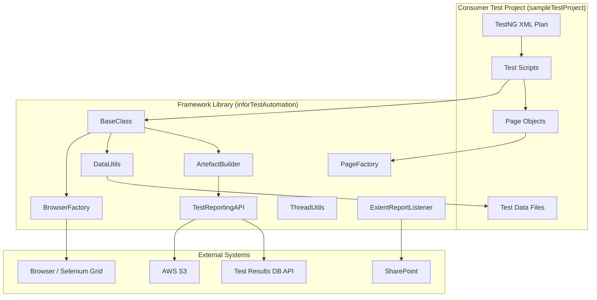
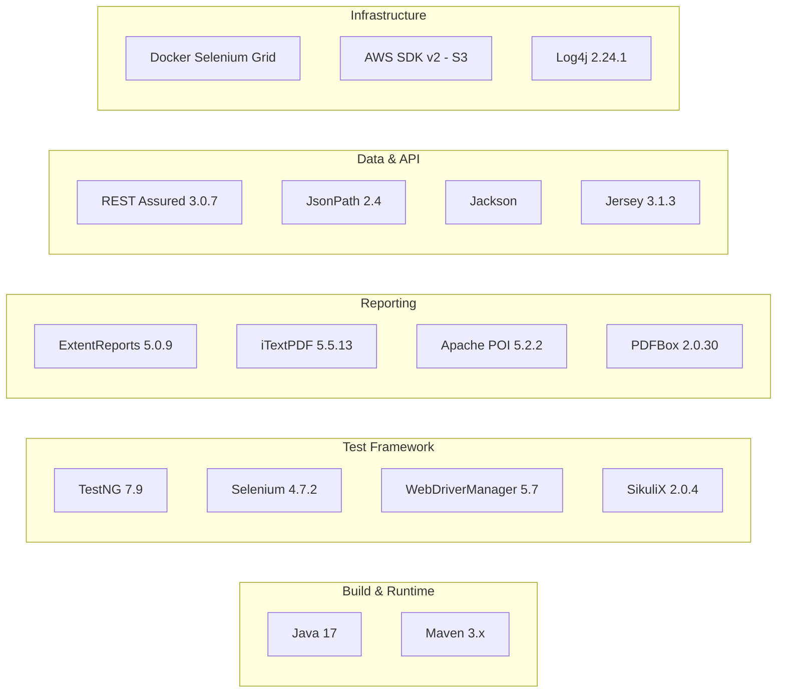
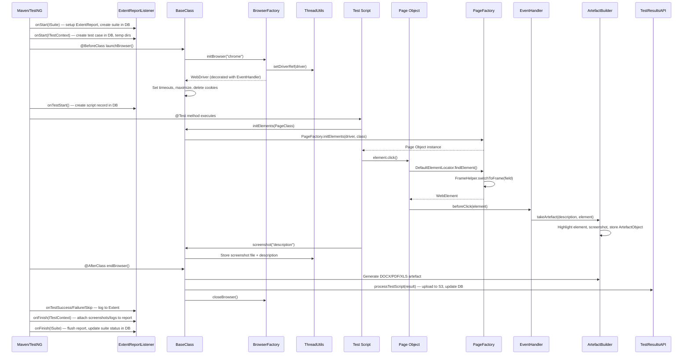
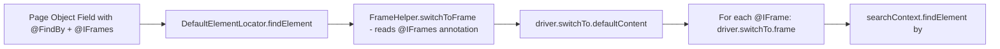
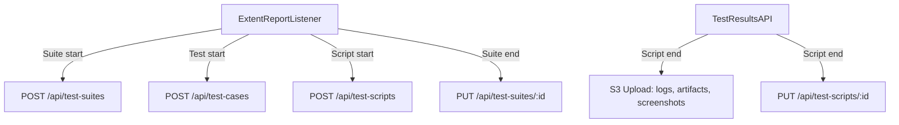
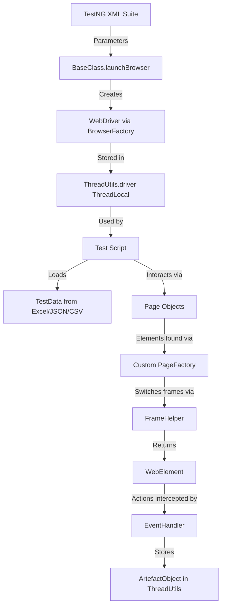

# Infor CQA Test Automation Framework — Engineering Handbook

**Version:** 0.0.10  
**Last Updated:** August 2026  
**Audience:** New engineers joining Infor CQA test automation teams

---

## Table of Contents

1. [Project Introduction](#1-project-introduction)
2. [High-Level Architecture](#2-high-level-architecture)
3. [Folder Structure](#3-folder-structure)
4. [Test Execution Lifecycle](#4-test-execution-lifecycle)
5. [Module Deep-Dive](#5-module-deep-dive)
6. [Code Walkthrough](#6-code-walkthrough)
7. [Data Flow](#7-data-flow)
8. [Configuration](#8-configuration)
9. [Design Patterns](#9-design-patterns)
10. [Common Development Tasks](#10-common-development-tasks)
11. [Debugging Guide](#11-debugging-guide)
12. [Cheat Sheet](#12-cheat-sheet)

---

## 1. Project Introduction

### What Is This Project?

The **Infor CQA Test Automation** framework is an internal Java library that provides shared infrastructure for automated testing of Infor CloudSuite applications. Think of it as the "engine" that every test automation team plugs into — they write test scripts, and this library handles browser management, data loading, reporting, screenshots, and artifact generation.

### Business Problem

Infor CloudSuite is a family of enterprise applications (LN, WMS, ION, IDM Capture, etc.) delivered via a web-based multi-tenant platform. QA teams across multiple product lines need to:

- Automate regression testing of web UIs
- Run tests locally and on Docker-based Selenium Grids
- Generate evidence documents (DOCX/PDF with screenshots) for compliance
- Report results to a centralized database and S3 storage
- Handle complex iframe-based UIs common across CloudSuite apps

Without a shared framework, each team would duplicate browser setup, reporting, and data-handling code.

### Target Users

- QA Automation Engineers at Infor who write test scripts
- CI/CD pipelines (Jenkins) that execute suites headlessly
- Test leads who review generated evidence documents

### Major Features

| Feature | Description |
|---------|-------------|
| Browser lifecycle | Chrome/Firefox, local or remote (Docker Grid), headless support |
| Page Object Model | Custom `PageFactory` with automatic iframe switching |
| Test data | Excel, CSV, JSON, Properties file readers |
| Evidence generation | PDF and DOCX documents with screenshots per step |
| Reporting | ExtentReports HTML, CSV export, REST API to database |
| Desktop automation | SikuliX image-based element interaction |
| Retry logic | Configurable test retry via annotations |
| Parallel execution | Thread-safe via `ThreadLocal` design in `ThreadUtils` |

### Functional Scope

- Web UI automation (Selenium 4)
- Desktop UI automation (SikuliX)
- API verification (REST Assured — available but not heavily used in framework itself)
- Test data management
- Test result publishing

### Non-Functional Requirements

- Thread-safe for parallel TestNG execution
- Supports Java 17
- Deployable as a single JAR (fat JAR via Maven Shade)
- Configurable via TestNG XML parameters and `.env` files

---

## 2. High-Level Architecture

### System Architecture Diagram



### Technology Stack Diagram



### Key Architectural Decisions

| Decision | Rationale |
|----------|-----------|
| `ThreadLocal` for all state | Enables safe parallel test execution without shared mutable state |
| Custom `PageFactory` (not Selenium's) | Adds automatic iframe switching before element lookup |
| `EventFiringDecorator` on WebDriver | Intercepts clicks/sendKeys to auto-generate evidence screenshots |
| Fat JAR distribution | Consumer projects only need one dependency |
| TestNG XML for configuration | Parameters (URL, credentials, timeouts) live in suite files, not code |
| `.env` file for secrets | AWS keys and DB connection stay out of version control |

---

## 3. Folder Structure

### inforTestAutomation (The Library)

```
inforTestAutomation/
├── pom.xml                          # Maven build, dependencies, profiles
├── .env                             # AWS credentials (gitignored)
├── src/main/java/
│   ├── annotations/                 # Custom annotations
│   │   ├── Hidden.java              # Marks fields/types as hidden
│   │   ├── IFrame.java             # Defines an iframe (name, xpath, attributes)
│   │   ├── IFrames.java            # Container for multiple @IFrame annotations
│   │   ├── PopUp.java              # Interface for popup handling
│   │   └── RetryAnalyzer.java      # TestNG retry logic (max 2 retries)
│   │
│   ├── dataUtils/                   # Test data reading utilities
│   │   ├── CSVTabularData.java      # In-memory CSV table representation
│   │   ├── CSVTabularDataFile.java  # Reads CSV files into CSVTabularData
│   │   ├── ExcelDataFile.java       # Reads Excel files (Apache POI)
│   │   ├── JsonDataFile.java        # Reads JSON, supports JsonPath queries
│   │   ├── PropertiesDataFile.java  # Reads .properties files
│   │   ├── RuntimeData.java         # Random data generators (names, addresses, dates)
│   │   ├── SecureUtils.java         # SecureRandom utilities
│   │   └── ExcelData/               # Excel data model classes
│   │       ├── ExcelData.java       # Collection of sheets
│   │       ├── ExcelSheet.java      # Single sheet wrapper
│   │       └── TableData.java       # 2D table (rows × columns)
│   │
│   ├── pageFactory/                 # Custom Page Object infrastructure
│   │   ├── PageFactory.java         # Initializes page objects with proxied fields
│   │   ├── DefaultElementLocator.java    # Locates elements WITH iframe switching
│   │   ├── DefaultElementLocatorFactory.java # Creates locators
│   │   ├── FrameHelper.java        # Switches to correct iframe before find
│   │   ├── FrameType.java          # Constants: IFRAME, FRAME
│   │   └── desktop/                 # Sikuli desktop automation
│   │       ├── FindBy.java          # @FindBy for images (similarity, offset)
│   │       ├── FindByImage.java     # Single image locator
│   │       ├── FindByImages.java    # Multiple image alternatives
│   │       ├── FindByImageResourceLocation.java # Class-level image path
│   │       └── SikuliFactory.java   # Initializes SikuliElement fields
│   │
│   ├── testBase/                    # Core framework classes
│   │   ├── BaseClass.java           # THE base class all tests extend
│   │   ├── BasePageObject.java      # Base for web page objects
│   │   ├── BaseDesktopPage.java     # Base for Sikuli desktop page objects
│   │   ├── BrowserFactory.java      # Creates Chrome/Firefox (local/remote)
│   │   ├── Driver.java              # Initializes and quits WebDriver
│   │   ├── ThreadUtils.java         # ThreadLocal storage for all state
│   │   ├── TestData.java            # Access test data files
│   │   ├── ArtefactBuilder.java     # Captures evidence screenshots
│   │   ├── SikuliElement.java       # Wrapper for Sikuli actions
│   │   ├── SharepointActions.java   # Upload reports to SharePoint (commented out)
│   │   ├── listners/                # TestNG listeners
│   │   │   ├── ExtentReportListener.java  # Main listener (suite/test/method events)
│   │   │   ├── ExtentReportNG.java        # Configures ExtentReports
│   │   │   ├── ExtentReportSupportMethods.java # Report attachment helpers
│   │   │   ├── EventHandler.java          # WebDriverListener for auto-screenshots
│   │   │   ├── LogFormatter.java          # Log4j2 configuration per test
│   │   │   ├── API_Call.java              # Publishes results to ATS database
│   │   │   ├── AnnotationTransformer.java # (Unused) retry transformer
│   │   │   ├── RetryListner.java          # (Unused) retry listener
│   │   │   ├── RetryAnalyzer.java         # (Commented out) retry logic
│   │   │   ├── DateTimeUtils.java         # Date formatting helpers
│   │   │   └── ImageLister.java           # Lists images in a directory
│   │   └── documetation/            # Document generation
│   │       ├── DOCXGenerator.java   # Generates DOCX evidence documents
│   │       ├── PDFGenerator.java    # Generates PDF evidence documents
│   │       ├── PDFHeaderFooterPageEvent.java # PDF header/footer
│   │       ├── PDFReportObject.java # Report metadata DTO
│   │       ├── ArtefactObject.java  # Single screenshot + description
│   │       ├── DateFormat.java      # Date format constants
│   │       └── testClase.java       # Utility for base64 image encoding
│   │
│   ├── testReportingAPI/            # REST API client for test DB
│   │   ├── TestResultsAPI.java      # Processes results, uploads to S3
│   │   ├── S3Service.java           # AWS S3 file upload
│   │   ├── ConfigLoader.java        # Loads .env file properties
│   │   ├── APILoggerConfig.java     # Dedicated file logger for API calls
│   │   ├── CustomLogFormatter.java  # Log format for API logger
│   │   └── dto/                     # Data Transfer Objects
│   │       ├── TestSuiteRequest.java
│   │       ├── TestSuiteUpdateRequest.java
│   │       ├── TestCaseRequest.java
│   │       ├── TestCaseUpdateRequest.java
│   │       ├── TestScriptRequest.java
│   │       └── TestScriptUpdateRequest.java (implied)
│   │
│   └── MailCheck.java               # Email sending utility (standalone)
│
├── doc/                             # Generated Javadoc
└── target/                          # Build output
```

### sampleTestProject (Consumer Reference)

```
sampleTestProject/
├── pom.xml                          # Depends on inforTestAutomation:0.0.10
├── src/main/java/
│   ├── commons/                     # Shared utilities
│   │   ├── Cloudsuite.java          # Login/logout/navigate helpers
│   │   └── AppMenu.java            # Application menu navigation
│   ├── config/
│   │   ├── config.properties        # Runtime config (highlight color)
│   │   ├── companyLogo.png          # Logo for reports
│   │   └── sharepointDetails.json   # SharePoint upload config
│   ├── constants/
│   │   ├── COMMONS.java             # Status constants
│   │   └── PRODUCTNAMES.java        # Product name constants
│   ├── contexts/                    # Test context objects for data passing
│   │   ├── CSLoginContext.java      # Login credentials context
│   │   └── LNPurchaseOrderContext.java # PO test data context
│   ├── data/                        # Test data files (Excel, CSV, JSON)
│   ├── pages/                       # Page Object classes
│   │   ├── Homepages.java
│   │   ├── PurchaseOrderPage.java
│   │   └── TestPage.java           # Example with @IFrames
│   ├── plan/                        # TestNG XML suite files
│   │   ├── SampleSuite.xml
│   │   ├── PurchaseOrderBasic.xml
│   │   └── ... (20+ suite files)
│   ├── scripts/                     # Test script classes
│   │   ├── AppTest.java             # Simple demo test
│   │   ├── TCLN_LNCreateApprovePurchaseOrder.java
│   │   └── ... (40+ test classes)
│   ├── workflow/                    # Workflow orchestration (mostly stubs)
│   └── desktop/                     # Sikuli desktop page objects
├── docker-zalenium-compose.yml      # Zalenium grid (auto-scaling)
├── dockerCompose2_new.yml           # Selenium Grid 4 (hub + chrome node)
├── MakeJar.bat                      # mvn clean install -DskipTests
├── start_dockergrid.bat             # Starts Docker grid
└── stop_dockergrid.bat              # Stops Docker grid
```

---

## 4. Test Execution Lifecycle

### Complete Flow Diagram



### Step-by-Step Explanation

1. **Suite Start**: `ExtentReportListener.onStart(ISuite)` initializes the HTML report and creates a test suite record in the database via REST API.

2. **Test Context Start**: For each `<test>` in the XML, a temp directory is created, the `ITestContext` is stored in `ThreadUtils`, and a test case record is created in the DB.

3. **Browser Launch**: `BaseClass.@BeforeClass` calls `BrowserFactory.initBrowser()` which:
   - Uses `WebDriverManager` to auto-download the correct chromedriver
   - Configures Chrome options (download path, headless for Jenkins, etc.)
   - Wraps the driver in `EventFiringDecorator` with `EventHandler`
   - Stores the driver in `ThreadUtils.setDriverRef()`

4. **Test Execution**: The `@Test` method runs. When interacting with page objects:
   - `PageFactory` creates lazy proxies for `@FindBy` fields
   - `DefaultElementLocator.findElement()` calls `FrameHelper.switchToFrame()` first
   - `EventHandler.beforeClick()` captures an evidence screenshot automatically

5. **Cleanup**: `@AfterClass` generates evidence documents (DOCX/PDF), uploads artifacts to S3, publishes results to the database, and quits the browser.

6. **Report Finalization**: `onFinish` attaches screenshots, logs, and artifact downloads to the ExtentReports HTML output.

---

## 5. Module Deep-Dive

### 5.1 testBase — The Core Engine

**Purpose**: Contains the foundational classes that every test relies on.

#### BaseClass.java (Line 81, ~900 lines)

The single most important class. Every test script extends it. Annotated with `@Listeners(ExtentReportListener.class)`.

**Key responsibilities:**
- `@BeforeClass launchBrowser()` — browser initialization
- `@AfterClass endBrowser()` — cleanup + artifact generation
- `getDriver()` — returns the thread-local WebDriver
- `getParameter(key)` — reads from TestNG XML, system properties, or class-level params
- `initElements(Class)` — instantiates page objects
- `screenshot(description)` — captures a labeled screenshot
- `await(timeout)` — returns configured `WebDriverWait`
- `pause(seconds)` — static sleep (use sparingly)
- `forceClick(element)` — JavaScript click with auto-evidence capture
- `getDynamicElement(element, vars...)` — resolves `%s` placeholders in locators
- `isElementPresent(element)` — checks element existence with wait
- `setCache/getCache` — suite-level data sharing between tests

#### ThreadUtils.java (~500 lines)

The thread-safety backbone. All mutable state is stored in `ThreadLocal` variables:

```java
private static ThreadLocal<WebDriver> driver = new ThreadLocal<>();
private static ThreadLocal<Logger> logger = new ThreadLocal<>();
private static ThreadLocal<String> tempDirectoryPath = new ThreadLocal<>();
private static ThreadLocal<List<ArtefactObject>> artefactObj = new ThreadLocal<>();
// ... 15+ more ThreadLocal fields
```

Also uses `ConcurrentHashMap` for DB IDs (suiteID, caseID, scriptID) since these need cross-thread visibility within a suite.

#### BrowserFactory.java

Handles two modes:
- **Remote** (`remote=true`): Creates `RemoteWebDriver` pointing at a Selenium Grid URL
- **Local** (`remote` is null/false): Uses `WebDriverManager` to auto-download chromedriver, then creates `ChromeDriver`

Chrome options include: download directory, headless mode for Jenkins, custom zoom scale, and various stability flags.

#### ArtefactBuilder.java

The evidence-generation engine. Key concept: every browser interaction can be recorded as an `ArtefactObject` (description + screenshot). At test end, these are assembled into a DOCX or PDF.

- `takeArtefact(description, element)` — highlights element with a colored border, screenshots, stores
- `artefactSS(description, elements...)` — manual evidence capture for custom functions
- `addSubHeader(description)` — adds a section header to the document
- `setCustAct(flag)` — toggle automatic evidence capture on/off

### 5.2 pageFactory — Custom Element Location

**Why custom?** Infor CloudSuite apps use deeply nested iframes. Selenium's built-in `PageFactory` does NOT switch frames before locating elements. This custom implementation does.

#### How It Works



The `@IFrames` annotation on a field tells the locator which iframe hierarchy to navigate before finding the element.

#### Dynamic Elements

Locators can contain `%s` placeholders:

```java
@FindBy(how = How.XPATH, using = "//span[text()='%s']/..")
public WebElement menuIcon1;

// Usage:
getDynamicElement(page.menuIcon1, "Purchase Orders");
```

### 5.3 dataUtils — Test Data Management

| Class | Purpose | Example |
|-------|---------|---------|
| `ExcelDataFile` | Read Excel workbooks | `TestData.getExcelDataFile("data.xlsx").getExcel().sheet("Sheet1").get(1,0)` |
| `JsonDataFile` | Read JSON, query with JsonPath | `TestData.getJsonDataFile("config.json").valueAtJpath("$.user.name")` |
| `PropertiesDataFile` | Read .properties | `TestData.getPropertyFile("creds.properties").get("password")` |
| `CSVTabularDataFile` | Read delimited CSV | `TestData.getCSVFile("data.csv").getTable().get(1,0)` |
| `RuntimeData` | Generate random data | `RuntimeData.getFirstName()`, `RuntimeData.getEmailAddress()` |

Data files are resolved from `src/main/java/data/<subfolder>/`. The subfolder is set via:
```java
TestData.setDataFolder("myTestData");
```

### 5.4 testReportingAPI — Result Publishing

Publishes test execution metadata and artifacts to a REST API + S3.



**S3Service.java**: Uploads files to AWS S3 using credentials from `.env` file. Supports static credentials or IAM role (EC2).

**ConfigLoader.java**: Reads `.env` files from multiple locations (current dir, parent, workspace root) and falls back to environment variables.

### 5.5 listeners — TestNG Event Handling

#### ExtentReportListener

The main orchestrator. Implements `ITestListener`, `ISuiteListener`, `IReporter`, `IConfigurationListener`. Responsibilities:
- Creates/flushes ExtentReports
- Creates temp directories per test
- Attaches screenshots, logs, and artifact files to the HTML report
- Publishes results to the database
- Generates CSV report

#### EventHandler

Implements `WebDriverListener` (Selenium 4). Intercepts:
- `beforeClick` — auto-generates evidence with element description
- `afterSendKeys` — records what was typed (masks passwords)
- `beforeClear` — records field clearing

This is how the framework auto-documents every user interaction without explicit screenshot calls.

### 5.6 desktop (SikuliX)

For testing desktop applications or areas where web locators fail:

- `BaseDesktopPage<B>` — extends for desktop pages, initializes `SikuliFactory`
- `SikuliElement` — wraps Sikuli operations: click, doubleClick, type, paste, exists, wait, dragDrop
- `@FindByImageResourceLocation("\\path\\to\\images\\")` — class-level annotation for image folder
- `@FindByImage("button.png")` — field-level annotation for image file

---

## 6. Code Walkthrough

### 6.1 A Complete Test: Login to CloudSuite

Let's trace a real test from the sample project:

```java
// scripts/AppTest.java
package scripts;

import org.testng.annotations.BeforeMethod;
import org.testng.annotations.Test;
import testBase.BaseClass;

public class AppTest extends BaseClass {

    @BeforeMethod
    public void sampleLog() {
        log().info("====== [AppTest] Before Test Method ======");
        screenshot("[AppTest] Test 1");
    }

    @Test
    public void AppTest() throws Exception {
        screenshot("[AppTest] Test 2");
        log().info("====== [AppTest] Test Started ======");
        getDriver().get("https://google.com");
        Thread.sleep(2000);
        log().info("====== [AppTest] Test Finished ======");
        screenshot("[AppTest] Test 3");
    }
}
```

**What happens behind the scenes:**

1. `AppTest extends BaseClass` → inherits `@BeforeClass launchBrowser()` and `@AfterClass endBrowser()`
2. TestNG reads the suite XML parameters (browser, URL, timeouts)
3. `launchBrowser("chrome")` creates the browser and stores it thread-locally
4. `@BeforeMethod sampleLog()` runs — logs and takes a screenshot
5. `@Test AppTest()` runs — navigates to Google, takes screenshots
6. On completion, `@AfterClass endBrowser()` generates evidence documents and closes the browser

### 6.2 The Login Workflow (commons/Cloudsuite.java)

```java
public static void login(CSLoginContext loginContext) {
    Homepages homepage = initElements(Homepages.class);  // 1
    getDriver().get(loginContext.url);                    // 2
    homepage.username.sendKeys(loginContext.username);    // 3
    homepage.password.sendKeys(loginContext.password);    // 4
    screenshot("Entered U and P");                       // 5
    homepage.submit.click();                             // 6
}
```

Step by step:
1. `initElements` → calls custom `PageFactory` → creates a `Homepages` instance with proxied `@FindBy` fields
2. Navigates to the CloudSuite URL
3. Types username — `EventHandler.afterSendKeys()` fires → evidence screenshot captured automatically
4. Types password — EventHandler masks it as `****` in the evidence
5. Explicit screenshot with a label
6. Click submit — `EventHandler.beforeClick()` fires → captures "Click 'Sign In' button" evidence

### 6.3 How Iframe Switching Works

```java
// pages/TestPage.java
@IFrames({
    @IFrame(xpath = "//iframe[contains(@name,'LN_')]",
            frameType = FrameType.IFRAME,
            attributes = {"class=m-app-frame", ...})
})
@FindBy(how = How.ID, using = "icon-menu")
public WebElement menuIcon;
```

When `menuIcon` is accessed:
1. `DefaultElementLocator.findElement()` is called
2. It calls `FrameHelper.switchToFrame(field)`
3. `FrameHelper` reads `@IFrames` → `driver.switchTo().defaultContent()` → `driver.switchTo().frame(iframeElement)`
4. Only then does `searchContext.findElement(By.id("icon-menu"))` execute

### 6.4 ThreadUtils — Why Everything Is ThreadLocal

TestNG can run tests in parallel. Without `ThreadLocal`, parallel tests would share the same WebDriver instance, causing chaos. Example:

```java
// Thread 1: Test A opens Chrome
ThreadUtils.setDriverRef(chromeDriverA);

// Thread 2: Test B opens Chrome (different instance)
ThreadUtils.setDriverRef(chromeDriverB);

// Thread 1 calls getDriver() — gets chromeDriverA ✓
// Thread 2 calls getDriver() — gets chromeDriverB ✓
```

Every piece of state (driver, logger, screenshots, temp paths, report objects) is isolated per thread.

---

## 7. Data Flow

### Request Flow (Test Execution)



### Evidence Generation Flow

```mermaid
graph TD
    A[Test Actions] -->|EventHandler captures| B[ArtefactObject List]
    C[Explicit screenshot calls] -->|screenshot method| D[Screenshot Files]
    B --> E{@AfterClass endBrowser}
    D --> E
    E -->|generateDocument=docx| F[DOCXGenerator]
    E -->|generateDocument=pdf| G[PDFGenerator]
    E -->|generateDocument=xls| H[XLS Step List]
    F --> I[DOCX File with screenshots + steps table]
    G --> J[PDF File with screenshots + summary]
    I --> K[S3 Upload via TestResultsAPI]
    J --> K
    D --> L[Combined into PDF for S3]
    L --> K
```

### Error Flow

When a test fails:
1. `ExtentReportListener.onTestFailure()` captures a failure screenshot (base64)
2. The screenshot + stack trace is embedded in the Extent HTML report
3. `TestResultsAPI.processTestScript()` records the failure reason in the DB
4. The failure screenshot is saved as `TestscriptFailedPoint.png` for the API upload

### Data Sharing Between Tests

Tests within the same suite can share data via the cache mechanism:
```java
// Test A: Store a value
setCache("purchaseOrderNumber", "PO-12345");

// Test B (same suite): Retrieve it
String poNumber = (String) getCache("purchaseOrderNumber");
```

This uses `ITestContext.getSuite().setAttribute()` — shared across the entire suite run.

---

## 8. Configuration

### Configuration Hierarchy (Precedence: high → low)

1. **System properties** (`-DparamName=value` on command line)
2. **Class-level parameters** (TestNG XML `<class>` local params)
3. **Test-level parameters** (TestNG XML `<test>` params)
4. **Suite-level parameters** (TestNG XML `<suite>` params)
5. **Default values** (hardcoded in `getParameter(key, default)`)

### TestNG XML Parameters

```xml
<suite name='SampleSuite' parallel="tests" thread-count="3">
    <!-- Environment -->
    <parameter name="BASE_URL" value="https://your-environment-url.example.com" />
    <parameter name="USER_NAME" value="test.user@example.com" />
    <parameter name="PASSWORD" value="secretPassword" />

    <!-- Browser -->
    <parameter name="browserName" value="chrome" />
    <parameter name="CHROME_VERSION" value="120" />  <!-- Optional pin -->

    <!-- Timeouts (seconds) -->
    <parameter name="implicitlyWaitTime" value="5" />
    <parameter name="pageLoadTimeout" value="120" />
    <parameter name="scriptTimeout" value="30" />

    <!-- Execution mode -->
    <parameter name="remote" value="true" />
    <parameter name="remoteURL" value="http://localhost:4444/wd/hub" />
    <parameter name="Jenkins_Execution" value="yes" />

    <!-- Evidence -->
    <parameter name="generateDocument" value="docx" />  <!-- docx | pdf | xls | false -->

    <!-- Database publishing -->
    <parameter name="publishToDB" value="true" />

    <!-- Reporting -->
    <parameter name="Publish_TestResults" value="yes" />

    <!-- Iframe handling -->
    <parameter name="frame_to_ignore" value="name:ignored_frame" />

    <!-- Data folder override -->
    <parameter name="dataFolder" value="myData" />
</suite>
```

### .env File (AWS/S3 Configuration)

Located at project root. Used by `ConfigLoader.java`:

```properties
AWS_ACCESS_KEY_ID=AKIA...
AWS_ACCESS_SECRET_KEY=secret...
AWS_S3_REGION_NAME=us-east-1
AWS_STORAGE_BUCKET_NAME=ipc-bucket
```

### config/config.properties

```properties
highlightColor=Lime
```

Controls the border color used when highlighting elements for evidence screenshots.

---

## 9. Design Patterns

### 9.1 Page Object Model (POM)

**Where**: Every class in `pages/` package  
**Why**: Separates element locators from test logic, improving maintainability

```java
public class PurchaseOrderPage extends BasePageObject<PurchaseOrderPage> {
    @FindBy(how = How.ID, using = "orderNumber")
    public WebElement orderNumberField;

    @FindBy(how = How.XPATH, using = "//button[text()='Submit']")
    public WebElement submitButton;
}
```

### 9.2 Factory Pattern

**Where**: `BrowserFactory`, `PageFactory`, `SikuliFactory`  
**Why**: Encapsulates complex object creation logic

- `BrowserFactory.initBrowser("chrome")` — creates the appropriate driver based on config
- `PageFactory.initElements(driver, class)` — reflectively initializes page object fields

### 9.3 Decorator Pattern

**Where**: `EventFiringDecorator` wrapping WebDriver  
**Why**: Transparently intercepts all driver interactions without modifying test code

```java
listener = new testBase.listners.EventHandler();
return new EventFiringDecorator(listener).decorate(dr);
```

### 9.4 Template Method Pattern

**Where**: `BaseClass` (`@BeforeClass` / `@AfterClass`)  
**Why**: Defines the test lifecycle skeleton; subclasses only implement `@Test` methods

### 9.5 Observer Pattern

**Where**: TestNG Listeners (`ExtentReportListener`, `EventHandler`)  
**Why**: Reacts to test events without coupling reporting logic to test code

### 9.6 Thread-Local Singleton (per thread)

**Where**: `ThreadUtils`  
**Why**: Each parallel thread gets its own "singleton" instance of driver, logger, etc.

### 9.7 Strategy Pattern

**Where**: Evidence generation (`generateDocument` parameter)  
**Why**: The same `@AfterClass` logic delegates to different generators based on config:
- `"docx"` → `DOCXGenerator`
- `"pdf"` → `PDFGenerator`
- `"xls"` → Excel-only step list

### 9.8 Context Object Pattern

**Where**: `contexts/` package in sample project  
**Why**: Bundles related test data into typed objects for passing between test steps

```java
@Data
public class LNPurchaseOrderContext {
    public String businessPartner;
    public String purchaseOffice;
    public String item;
    public String quantity;
}
```

---

## 10. Common Development Tasks

### 10.1 Add a New Test Script

1. Create a class in `src/main/java/scripts/`:
```java
package scripts;

import testBase.BaseClass;
import org.testng.annotations.Test;

public class TCLN_MyNewTest extends BaseClass {
    @Test
    public void myTestMethod() {
        // Test logic here
    }
}
```

2. Add it to a TestNG XML plan in `src/main/java/plan/`:
```xml
<test name="MyNewTest">
    <classes>
        <class name="scripts.TCLN_MyNewTest" />
    </classes>
</test>
```

3. Run: `mvn test -DTEST_PLAN=MyPlan.xml`

### 10.2 Add a New Page Object

```java
package pages;

import org.openqa.selenium.WebElement;
import org.openqa.selenium.support.FindBy;
import org.openqa.selenium.support.How;
import annotations.IFrame;
import annotations.IFrames;
import pageFactory.FrameType;
import testBase.BasePageObject;

public class MyPage extends BasePageObject<MyPage> {

    @IFrames({
        @IFrame(xpath = "//iframe[contains(@name,'App_')]", frameType = FrameType.IFRAME)
    })
    @FindBy(how = How.ID, using = "myElement")
    public WebElement myElement;

    @FindBy(how = How.XPATH, using = "//button[text()='%s']")
    public WebElement dynamicButton;  // Use getDynamicElement(page.dynamicButton, "Save")
}
```

### 10.3 Add a New Data File

1. Place file in `src/main/java/data/<subfolder>/`
2. In test:
```java
TestData.setDataFolder("subfolder");
ExcelDataFile excel = TestData.getExcelDataFile("myData.xlsx");
String value = excel.getExcel().sheet("Sheet1").get(1, 0);
```

### 10.4 Enable Evidence Document Generation

Add parameter to TestNG XML:
```xml
<parameter name="generateDocument" value="docx" />
```

Set test details for the summary table:
```java
PDFReportObject details = new PDFReportObject();
details.setDescription("Verify purchase order creation");
details.setProcess("Procurement");
details.setUsecaseId("TC-001");
details.setUser("Buyer role");
details.setPrerequisites("Supplier exists in system");
setTestDetails(details);
```

### 10.5 Run Tests on Docker Selenium Grid

1. Start the grid: `start_dockergrid.bat` (or `docker-compose -f dockerCompose2_new.yml up`)
2. Add parameters to TestNG XML:
```xml
<parameter name="remote" value="true" />
<parameter name="remoteURL" value="http://localhost:4444/wd/hub" />
```
3. Run: `mvn test -DTEST_PLAN=MySuite.xml`

### 10.6 Build and Deploy the Library

```bash
# Compile
mvn clean compile

# Package (standard JAR)
mvn clean package

# Package fat JAR with all dependencies
mvn clean package -PDistribute

# Deploy to internal Nexus
mvn clean deploy
```

### 10.7 Pass Data Between Test Classes in a Suite

```java
// In first test class:
setCache("orderNumber", generatedOrderNumber);

// In subsequent test class (same suite):
String orderNumber = (String) getCache("orderNumber");
```

---

## 11. Debugging Guide

### 11.1 Where Are Logs?

Each test creates isolated log files at:
```
artefact/temp/<randomID>/<TestClassName>/log/
├── TestClassName_actionLog.txt    # INFO level only (actions taken)
└── TestClassName_detailedLog.txt  # DEBUG level (everything)
```

Use `log().info("message")` in tests. The logger is thread-specific.

### 11.2 Common Failures and Solutions

| Symptom | Likely Cause | Solution |
|---------|-------------|----------|
| `NullPointerException` in `getDriver()` | Browser didn't launch (exception in `@BeforeClass`) | Check console for `BrowserFactory` errors |
| `NoSuchElementException` | Element not in current iframe | Add/fix `@IFrames` annotation on the field |
| `StaleElementReferenceException` | Page reloaded, element reference is stale | Use `getDynamicElement()` to re-find |
| `TimeoutException` on page load | Page load timeout too short | Increase `pageLoadTimeout` parameter |
| Screenshots show wrong page | Iframe not switched back | Call `getDriver().switchTo().defaultContent()` |
| Evidence document is empty | `generateDocument` param not set | Add `<parameter name="generateDocument" value="docx"/>` |
| S3 upload fails | Missing `.env` file or wrong credentials | Check `S3Log.log` in project root |
| Tests interfere with each other | Shared mutable state | Ensure all state goes through `ThreadUtils` |
| ChromeDriver version mismatch | Cached driver is outdated | `BrowserFactory` clears cache, but check manually |

### 11.3 Debugging Evidence Generation

If DOCX/PDF is not generated:
1. Check `generateDocument` parameter is set to `docx`, `pdf`, or `xls`
2. Check `ArtefactBuilder.getCustFlagRef()` is `true` (not disabled by `setCustAct(false)`)
3. Check `ThreadUtils.getArtefactRef()` has entries
4. Look for exceptions in the detailed log file

### 11.4 Debugging Parallel Execution Issues

If tests fail when run in parallel but pass sequentially:
1. Check for static mutable fields (should use `ThreadLocal` instead)
2. Check `thread-count` in TestNG XML isn't too high for the machine
3. Ensure page objects don't share state between instances
4. Use `log()` with test-specific messages to trace which thread does what

### 11.5 Useful Breakpoint Locations

| File | Line/Method | Why |
|------|-------------|-----|
| `BaseClass.java` | `launchBrowser()` | Verify browser config |
| `BrowserFactory.java` | `initBrowser()` | Catch driver creation issues |
| `DefaultElementLocator.java` | `findElement()` | Debug element not found |
| `FrameHelper.java` | `switchToFrame()` | Debug iframe switching |
| `EventHandler.java` | `beforeClick()` | See what evidence is captured |
| `ArtefactBuilder.java` | `takeArtefact()` | Debug missing evidence |
| `ExtentReportListener.java` | `onTestFailure()` | See failure handling |

### 11.6 The API/S3 Logger

All `testReportingAPI` operations log to `S3Log.log` in the project root (not the test-specific log). Check this file for:
- S3 upload failures
- API response errors
- Missing credentials

---

## 12. Cheat Sheet

### Architecture at a Glance

```
Test Script → extends BaseClass → uses PageFactory → drives WebDriver → reports via Listeners
```

### Essential Classes

| Class | One-line Purpose |
|-------|-----------------|
| `BaseClass` | Base for all tests — driver, screenshots, utils |
| `ThreadUtils` | Thread-safe state storage |
| `BrowserFactory` | Creates Chrome/Firefox instances |
| `PageFactory` | Initializes page objects with iframe awareness |
| `FrameHelper` | Switches to correct iframe before element find |
| `BasePageObject<T>` | Base for page objects |
| `TestData` | Access test data files |
| `ArtefactBuilder` | Evidence screenshot capture |
| `EventHandler` | Auto-captures evidence on click/type |
| `ExtentReportListener` | Orchestrates reporting and DB publishing |
| `DOCXGenerator` | Builds evidence DOCX documents |
| `TestResultsAPI` | Publishes results + uploads to S3 |
| `ConfigLoader` | Reads .env file for AWS credentials |
| `SikuliElement` | Desktop automation actions |

### Key Commands

```bash
# Build library
mvn clean package

# Build fat JAR
mvn clean package -PDistribute

# Run tests
mvn test -DTEST_PLAN=SampleSuite.xml

# Run with system property override
mvn test -DTEST_PLAN=MySuite.xml -DBASE_URL=https://... -DbrowserName=firefox

# Start Docker Grid
docker-compose -f dockerCompose2_new.yml up -d

# Stop Docker Grid
docker-compose -f dockerCompose2_new.yml down

# Convert this handbook to DOCX
pandoc InforCQA_TestAutomation_Handbook.md -o Handbook.docx --toc --toc-depth=3
```

### Parameter Quick Reference

| Parameter | Default | Purpose |
|-----------|---------|---------|
| `browserName` | chrome | Browser to launch |
| `remote` | (null) | Set "true" for Selenium Grid |
| `remoteURL` | http://localhost:4444/wd/hub | Grid URL |
| `implicitlyWaitTime` | 10 | Seconds to wait for elements |
| `pageLoadTimeout` | 120 | Seconds for page load |
| `Jenkins_Execution` | (null) | Set "yes" for headless |
| `generateDocument` | false | docx / pdf / xls / false |
| `publishToDB` | false | Publish results to REST API |
| `Publish_TestResults` | no | Publish to ATS database |
| `dataFolder` | (null) | Override data subfolder |
| `frame_to_ignore` | (empty) | Skip specific iframes |
| `CHROME_VERSION` | (auto) | Pin Chrome version |
| `browser_zoom_scale` | (null) | Force browser zoom (e.g. 0.8) |

### Frequently Modified Files

| Task | File(s) to Modify |
|------|-------------------|
| Add new test | `scripts/NewTest.java` + `plan/Suite.xml` |
| Add page object | `pages/NewPage.java` |
| Change browser config | `BrowserFactory.java` → `chromeOptions()` |
| Fix iframe issues | Page object `@IFrames` annotations |
| Change report format | `DOCXGenerator.java` or `PDFGenerator.java` |
| Update library version | `pom.xml` → `<version>` |
| Add new data utility | `dataUtils/` package |
| Change logging | `LogFormatter.java` |

### Debugging Checklist

- [ ] Check console for stack traces
- [ ] Check `artefact/temp/*/TestClass/log/*_detailedLog.txt`
- [ ] Check `S3Log.log` for API/S3 issues
- [ ] Verify TestNG XML parameters are correct
- [ ] Verify `.env` file exists and has correct AWS keys
- [ ] Check if element is inside an iframe (add `@IFrames`)
- [ ] Check `Reports/` folder for ExtentReports HTML

### Important Annotations

```java
@IFrames({@IFrame(xpath="//iframe[...]", frameType=FrameType.IFRAME)})
// → Switches to iframe before finding element

@FindBy(how = How.XPATH, using = "//span[text()='%s']")
// → Dynamic locator, resolve with getDynamicElement(element, "value")

@Hidden
// → Marks field/type as hidden (framework internal)

@FindByImage("image.png")
// → Sikuli image-based element (desktop automation)

@FindByImageResourceLocation("\\path\\to\\images\\")
// → Class-level annotation specifying image folder for Sikuli
```

### Lifecycle Hooks Available

| Annotation | When | Use For |
|------------|------|---------|
| `@BeforeClass` | Before any test in class | (Handled by BaseClass — browser launch) |
| `@AfterClass` | After all tests in class | (Handled by BaseClass — cleanup) |
| `@BeforeMethod` | Before each @Test method | Per-test setup (navigate, login) |
| `@AfterMethod` | After each @Test method | Per-test cleanup |
| `@Test` | The actual test | Your test logic |

---

## Glossary

| Term | Definition |
|------|-----------|
| **ArtefactBuilder** | System that captures screenshots during interactions and compiles them into evidence documents |
| **BaseClass** | The parent class every test extends; provides driver, utils, lifecycle |
| **CloudSuite** | Infor's cloud-based ERP platform |
| **CQA** | Central Quality Assurance — the team that maintains this framework |
| **EventHandler** | WebDriverListener that auto-captures evidence |
| **ExtentReports** | Third-party HTML test report library |
| **Fat JAR** | A JAR containing all dependencies (built with Maven Shade) |
| **IFrame** | An HTML element that embeds another document; CloudSuite uses them heavily |
| **LN** | Infor LN — an ERP product (one of the apps tested) |
| **PageFactory** | Pattern + class that initializes page object fields with lazy proxies |
| **Selenium Grid** | Infrastructure for running browser tests on remote machines |
| **SikuliX** | Library for image-based GUI automation |
| **TestNG** | Java test framework (alternative to JUnit) used here for execution |
| **ThreadUtils** | Central `ThreadLocal` storage — the thread-safety backbone |
| **WMS** | Warehouse Management System — another Infor product |
| **Zalenium** | Docker-based Selenium Grid with auto-scaling and video recording |

---

*End of Handbook*

**To convert to DOCX:**
```bash
pandoc InforCQA_TestAutomation_Handbook.md -o InforCQA_TestAutomation_Handbook.docx --toc --toc-depth=3 --highlight-style=tango
```

**To convert to PDF:**
```bash
pandoc InforCQA_TestAutomation_Handbook.md -o InforCQA_TestAutomation_Handbook.pdf --toc --toc-depth=3 --pdf-engine=xelatex
```
